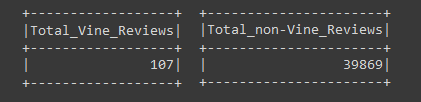
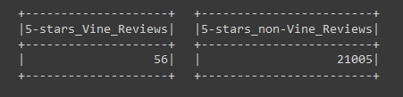
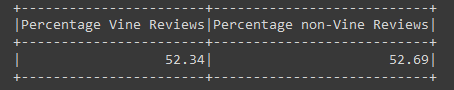
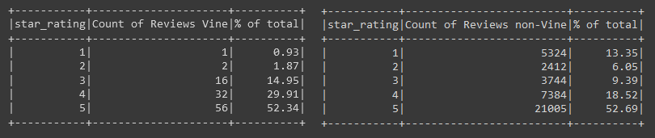

# Amazon Vine Review Analysis

## Project Overview
The purpose of this project is to use Amazon’s cloud service AWS, Google Colab and Pyspark to analyze Amazon’s reviews for outdoor products. From there, we need to analyse the data to see if there is a bias toward favorable reviews from Vine members (a service that allows manufacturers to have reviews posted on Amazon for their pre-release items, for an additional fee).  

## Resources
Data Source

-	[Amazon Vine Reviews for outdoors items](https://s3.amazonaws.com/amazon-reviews-pds/tsv/amazon_reviews_us_Outdoors_v1_00.tsv.gz)

Software:

-	Google Colab 
-	AWS
-	PgAdmin

Languages:

-	pySpark

## Results
The analysis required us to extract all the reviews that have more than 20 total votes and the percentage of helpful votes is equal or greater than 50.

The image below shows us the number of Vine and non-Vine reviews:

The image below shows us the number of five star reviews on Vine and five star reviews not on Vine:

The image below shows us the percentage of five star reviews on Vine and five star reviews not on Vine:

- **52.34 %** of **Vine** reviews were 5 stars and 
- **52.69 %** of **non-Vine** reviews were 5 stars.

## Summary

Now to know if there is any bias toward favorable reviews from Vine members in the dataset, we can use the reviews that have more than 20 total votes and the percentage of helpful votes equal or greater than 50. This selection indicates reviews that are more likely to be helpful.

With 5-star reviews based on the conditions above. Calculations show that there is no positivity bias for reviews in the Vine program. The results show that percentage of 5 stars Vine reviews is 52.34% and percentage of 5 stars non-Vine reviews is 52.69%. Non-Vine reviews actually have slightly higher percentage of the 5 stars reviews.

**Additional analyses and suggestions**

We could expand this analysis by calculating percentage for all stars reviews. There is a larger difference in percentage for 1-star reviews than for 5-stars reviews, as seen below.

Vine reviews have only 0.93% of 1-star reviews, non-Vine reviews have 13.35% 1-star reviews within these conditions, as well as 1.87% 2-stars Vine reviews and 6.05% 2-stars non-Vine reviews.  

The results show that there could be positivity bias for reviews in the Vine program, when looking from 1 and 2-star reviews perspective. 

